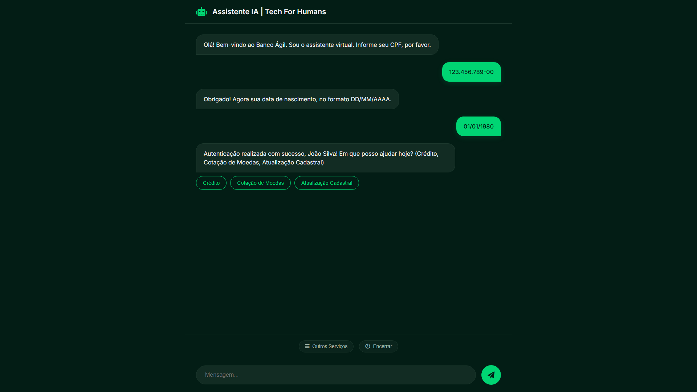

# 🏦 Banco Ágil - Assistente IA (Tech For Humans)

<div align="center">
  
</div>

Olá! Bem-vindo ao repositório do **Banco Ágil**. Criei este projeto como solução para o **Desafio Técnico para Desenvolvedor de Agente de IA da Tech For Humans**. 

Meu objetivo principal aqui foi construir um sistema de chat inteligente avançado, onde o usuário sinta que está conversando com um único cérebro super capaz (o que chamamos de *Single-Agent Illusion*), mas que, por debaixo dos panos, rodam diversos micro-agentes especializados trabalhando em conjunto sob a orquestração de um modelo de linguagem local.

---

## 🛠 A Minha Stack (Escolhas Técnicas e Justificativas)

Para entregar uma solução moderna, rápida e aderente ao escopo do desafio, optei pela seguinte stack de tecnologias:

- **Ollama + Llama 3.2**: Eu quis provar que o projeto poderia ter autonomia completa rodando `Local-First`, sem depender minimamente de faturamentos ou chaves da OpenAI. O Llama 3.2 é um modelo open-source espetacular, muito performático até em firmwares modestos, e com uma capacidade de raciocínio de alto nível, ideal para ser o cerne da lógica dos nossos agentes.
- **LangChain**: O LangChain facilitou demais a integração com o Ollama, mas o principal motivo da minha escolha ocorreu devido aos seus "Output Parsers" e encadeamentos (*Chains*). Com ele, eu não recebo apenas um bloco de texto bagunçado da IA; consegui forçar o robô a entregar dados estruturados (JSON Strict), o que me permitiu extrair as variáveis exatas na hora da entrevista financeira do usuário.
- **Python + FastAPI**: O *core* da aplicação. Escolhi o FastAPI por ser enxuto, extremamente rápido e, o mais importante, assíncrono por padrão (`async def`). Ao lidar com IAs e chamadas HTTP externas (como na cotação de moedas), o assincronismo é vital para manter o sistema responsivo. O sistema de roteadores prático (`APIRouter`) também ajudou imensamente a segmentar meus agentes.
- **Vanilla JS + HTML + CSS**: No frontend, optei por trabalhar na "unha", sem usar frameworks como React ou Vue. Por se tratar de um desafio de Agente focado em backend, eu quis garantir que quem fosse avaliar pudesse apenas "dar dois cliques" no index.html e rodar tudo, sem se preocupar em baixar pacotes infinitos (`node_modules`) ou configurar build-tools. As chamadas assíncronas no frontend garantem muita agilidade, complementando perfeitamente a API.
- **Arquivos CSV**: Como banco de dados das validações de regras e scores, utilizei abordagens diretas lendo arquivos `.csv`. Foi uma escolha puramente focada na eficiência de testes, dispensando que você precise levantar um container do PostgreSQL ou Mongo para brincar com o bot.

---

## 📖 Visão Geral do Projeto

A ideia do sistema é aposentar os jurássicos fluxos numéricos de URA ("Digite 1 para X"). Como resultado, temos aqui a inferência de rotas alimentada puramente por contexto (*NLP*). 

O cliente diz em linguagem humana: *"Eita, meu limite tá baixo, dá um jeito nisso?"*. Nesse momento, a nossa inteligência analisa a semântica da frase e despacha a requisição pro Agente correto. Caso o aumento não seja viável, ao invés do processo morrer, o sistema engatilha dinamicamente uma oportunidade: propõe ao usuário uma rápida Entrevista de Recálculo de Score para avaliar seus dados de forma humanizada.

---

## 🏗 Arquitetura do Sistema e Fluxos

Em vez de empilhar mil linhas em um só arquivo, criei um sistema puramente modular. Nossa Arquitetura possui 2 pilares: Serviços Core Globais e os Agentes Independentes em Roteadores menores (`api/routers/`).

### 1. Sistema Multi-Agente
- 🚪 **Agente de Triagem (`triagem.py`)**: O anfitrião do banco. É ele quem faz o "handshake" validando CPF e Data de Nascimento no nosso CSV. Depois de liberar o acesso, ele pergunta a vontade do cliente, interpreta a NLP, transfere o status ativamente para a próxima etapa em silêncio e desaparece se sentindo bem-sucedido.
- 💳 **Agente de Crédito (`credito.py`)**: Especialista em regras de negócio. Ele quem cruza o score atual e verifica a política ("Score 400 permite Limite Y?"). Quando os cálculos batem no teto limite de forma negativa, ele atua ativamente engatilhando a nossa sub-rotina do Perito de Entrevistas.
- 📋 **Agente de Entrevista (`entrevista.py`)**: O Perito de Risco de Conversão. Bate um papo simples para coletar informações base: Renda, Status de Emprego, Dependentes, Despesas e Dívidas. Pega todo o "lero-lero" falado pelo usuário, e usa o LangChain para compilar em um JSON, calculando a macrofórmula matemática que injeta via IO no CSV e eleva a chance do cliente. Re-transfere a aprovação para a malha do fluxo de crédito logrando êxito automático.
- 🌍 **Agente de Câmbio (`cambio.py`)**: Consome a API REST gratuita (AwesomeAPI). Com a inteligência local, entende desde jargões isolados a perguntas polidas. Passando "O euro eita," ele extrai `EUR` e puxa a cotação imediata convertida na nossa moeda `BRL`.

### 2. Backbones de Controle
- **LLM Service (`llm_service.py`)**: Como um "Data-lake Promptário", esse arquivo controla o encadeamento e instâncias do Llama e abriga o Try/Catch anti-pane caso o Hardware local desligue ou retorne um Timeout.
- **Memory Service / Sessão (`sessao.py`)**: Gerenciador In-Memory. Segrega o ID de chat da aba do front-end com um vetor persistente (`Role/Message`) mantendo forte controle do histórico. Também gerencia a máquina de estados como (`AGUARDANDO_CPF`, `AUTENTICADO`).

---

## 🚀 Funcionalidades que Implementei

- **Single-Agent Illusion**: Botões baseados em 'Outros Serviços'. Os roteamentos (`Ação Transferir`) nem chegam aos olhos do usuário; parece ser um só robô com mil habilidades.
- **Cotação Dinâmica Externa**: Consumo via Request lib para pegar cotação ativa da internet.
- **Workflow de Segunda Chance**: Processo interligado onde um score recusado é submetido sob a decisão do usuário a uma recálculo por entrevista ativa em tempo de execução, mudando a recusa do limite para aprovado na mesma conversa.
- **Resiliência de Stack**: O uso exaustivo de validação (Try/Catch) que lida ativamente caso o Llama sofra pane ao cuspir um JSON errado ou o banco CSV demore a ser aberto pelo S.O., re-emitindo um feedback educado contornando que a página do frontend "morra" esperando sinal.
- **Extrativismo de Dados Indiretos (Typos)**: Testado para ignorar erros de graúdo como "siiimbora fzer interwieem" e extrair perfeitamente o Boolean de "Aceitar" para prosseguir no fluxo da API.

---

## ⚔ Desafios Enfrentados (e como eu os resolvi)

Várias "cascas de bananas" arquiteturais apareceram, confira três delas que contornei:

1. **A 'Alucinação' no Output limitando fluxos na Triagem**:
   - *Desafio*: Quando perguntei sobre taxas do Câmbio, a LLM local em alguns casos divagou nas razões com o clássico texto "Não foi pedido Atualização Cadastral e sim Cotação". Como o IF do python lia a palavra "Atualização Cadastral" antes da palavra "Cotação", o robô enlouquecia jogando o cliente no limite.
   - *Solução*: Refiz a matriz heurística de varredura no código Python da rota. Engessando para parar a verificação mal encontrasse à primeiríssima ocorrência das Tags explícitas que caracterizam as Rotas (`break` condicional). Problema resolvido categoricamente!

2. **JSONs quebrando por respostas booleanas atípicas**:
   - *Desafio*: Extrair "sim" e "não" para saber se tinha dívidas não funcionava direto, os usuários podiam escrever coisas como "credo nunca". O `OutputParser` puro explodia por invalidez semântica.
   - *Solução*: Implementei o `JsonOutputParser` nativo forçando as estruturas usando Temperature à `0.0`. E, paralelamente, embuti Fallbacks Python no Back-End. ("Se tentar retornar Null nos dependentes, usa heurística do Python e varre se tem a palavra "não" para fixar o dependente a ZERO, salvando o sistema).

3. **Demora aparente no Front-end gerando atrito de UX**:
   - *Desafio*: O carregamento do Llama demorava entre 1 e 2 segundos. O usuário ficava na estaca zero olhando para uma tela sem sinal achando que o Request explodiu.
   - *Solução*: Recurso Vanilla minimalista: Adicionei Injeções do Elemento Assíncrono com evento de DOM para gerar as benditas "Bolinhas quicando de Carregamento" escondendo que a infraestrutura estava num long-polling aguardando o Status 200 da API Fast.  

---

## 🕹 Passo a Passo: Como rodar e testar o projeto

É muito fácil fazer a máquina funcionar. Você testará todo o complexo orquestrador em apenas 4 passos:

### Pré-requisitos Básicos:
Eu estruturei o sistema para usar as seguintes premissas (que eu recomendo ter instalado):
- **Python 3.10+** (Para a Engine de Agentes rodarem via Fast)
- **Ollama** (Motor de IA offline para nos dar inferência segura). Instale acessando: `https://ollama.com`

### Passo 1. Cérebro Base (LLM Local)
Abra seu terminal e baixe os pesos do nosso agente executando:
```bash
ollama run llama3.2
```
Ele instalará na sua máquina *(aprox 2GB)*. Assim que ver um prompt `>>>` esperando sua mensagem, pode fechar a janela com `Ctrl+D` ou sair dele. Todo o sistema do modelo já ficou habilitado.

### Passo 2. Ligando a Usina da API Python
Aponte o terminal para a nossa pasta baixada e siga para instalar nossos libs e ligar:
```bash
cd api
# Recomendo muito usar uma VENV (python -m venv venv), caso contrário instale livremente:
pip install -r requirements.txt

# Inicie ativando o comando uvicorn com recarga estática exclusando os csv dinâmicos (Evita re-starts durante os testes simulados de salvar variáveis no csv):
python main.py
```
A API vai piscar informando que acordou no IP `[http://0.0.0.0:8000]`

### Passo 3. Abrindo a Porta do Banco
Tudo pronto. Como eu montei o front para se desprender de Node e React para seu total conforto, tudo que você fará é abrir o diretório base da raiz (fora de `/api/`), ir para a pasta `/frontend/`  e **abrir o arquivo `index.html` em seu navegador** duplo-clique básico.

### Passo 4. Guia Simulado de Uso Prático (O Teste final):
Divirta-se. Use o seguinte cenário "Golden-Path Completo":

1. Simule como "João", envie o CPF simulado (`12345678900`) e passe as datas falsas `01/01/1980`.
2. Como um cliente insatisfeito, ignore as opções globais bonitas do template que criei, escreva solto: *"Kero aumentar tudo meus crédito"*.
3. O robô vai reagir te oferecendo o Menu respectivo. Puxando o botão para o alto digite um limite ignorante de `500000` *(Ou quinhentos mil inteiros)*. Observe como as matrizes internas o bloqueiam por ser irreal para o score de João mas logo em seguida abrem a Entrevista!
4. Responda positivamente para a entrevista. Aceite, simule, diga que sua ocupação é desempregado para observar se ele absorve para o JSON e finaliza o recálculo em aprovação limpa.
5. Termine escrevendo: *"Legal, quero ver a cotação do BTC (Bitcoin)"* e as bolinhas de chat mostrarão o motor chamando as rotas da web trazendo os centavos online no fechamento.

### Enjoy The Ride :D
Espero que você se divirta testando o código tanto quanto eu me diverti desenvolvendo. Foi incrível poder juntar o ecossistema LLM open-source dentro da casca corporativa da Tech for Humans!